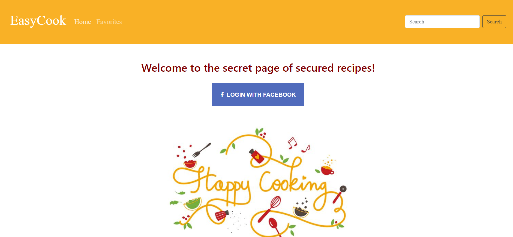
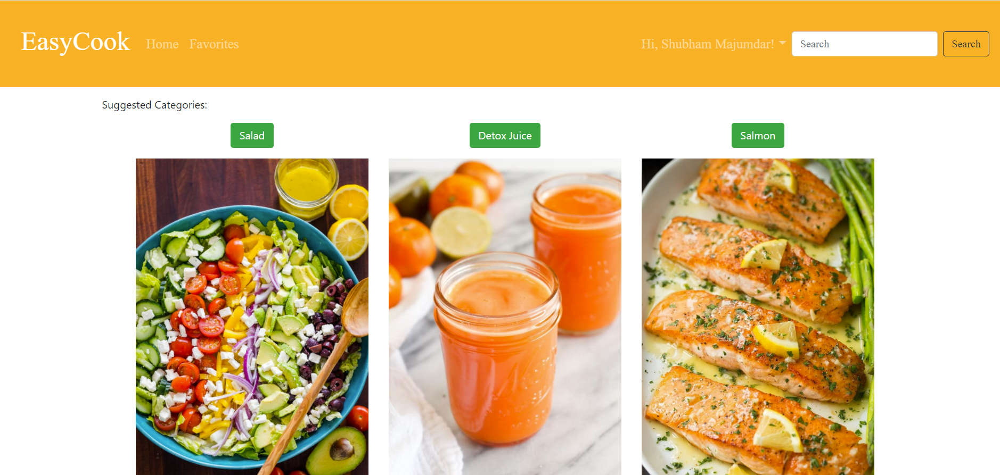

# Midterm Project: EasyCook

**Team Members**: Earl Jay Caoile, Shubham Majumdar, Tammy Ip

## Project description

Our application lets an user search for a recipe, add arecipe, remove arecipe and add a recipes to favourites.
Also usr is capable of creating an account and save recipes. The user should be capable of clicking on a link that will lead to purchase the ingredients on the recipe.

### Links and Resources

### Documentation

### Setup

Within Terminal/Git Bash:

1. From the main directory type `npm i` to install node modules
2. From the main directory, start the server with `nodemon hub.js`
3. Open another Terminal/Git Bash window, go to the public directory with `cd public`, and then start the live-server with `live-server`

### Tests

- Testing command: `npm test` from root directory

### UML

### Wireframe

